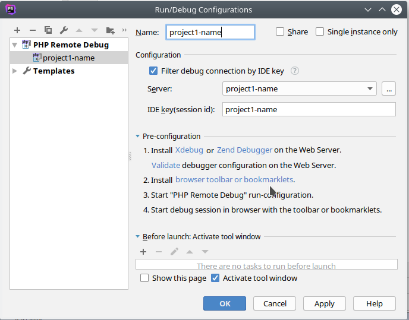
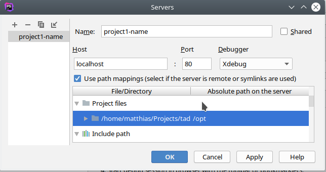

# kickstart-flavor PHP :: Apache2, PHP7.4 development container
[](https://github.com/nfra-project/kickstart-flavor-php/actions)
[](https://github.com/nfra-project/kickstart-flavor-php/releases)
[](https://github.com/nfra-project/kickstart-flavor-php)

see (http://github.com/infracamp/kickstart) for more information.

Document Index:

- [Development Guide for this flavor](DEVELOPMENT.md)
- [Dockerhub page](https://hub.docker.com/r/nfra/kickstart-flavor-php/)
    - [Tags available](https://hub.docker.com/r/nfra/kickstart-flavor-php/tags/)
    - [Build details](https://hub.docker.com/r/nfra/kickstart-flavor-php/builds/)


## Tags

*Use -min images in Dockerfile and main image in .kick.yml*

| Tag         | OS                      | Branch     |
|-------------|-------------------------|------------|
| 7.2         | Ubuntu 18.04            | 7.2-stable |
| 7.2-min     | Ubuntu 18.04            | 7.2-stable |
| 7.4         | Ubuntu 20.04            | 7.4-stable |
| 7.4-min     | Ubuntu 20.04            | 7.4-stable |
| unstable    | Ubuntu 20.04 (master)   | master     |

## Container specific ENV Configuration

| Env                      | Default                 | Description         |
|--------------------------|-------------------------|---------------------|
| `APACHE_CUSTOM_LOG`      | '/dev/null combined'    | How should apache log requests                |


## Container specific `.kick.yml`-directives

| Key | Default | Description |
|----------------|----------------|---------------------|
| `http_port`                  | `80`               | The internal port, apache listens on |
| `apache_document_root`       | `/var/www/html`    | The document root |
| `SYSLOG_HOST`                | ''                 | Send apache2 error log to this host             |


## Additional configuration

In `.kick.yml` you can modify the vhost settings

```yaml
apache_document_root: /opt/www
apache_vhost_config: |
    FallbackResource /index.php
    php_admin_value file_uploads 0
```

See [kickstart/conf/](kickstart/conf/) for default configuration. You can
override these by placing the files into `.kicker/conf/` directory of your
project.

See [kickstart/conf/](kickstart/_tpl/) for default configuration. You can
override these by placing the files into `.kicker/conf/` directory of your
project.


## Installed Software

Make sure your IDE has plugins installed for:

- **[editorconfig](https://editorconfig.org/#download)** 


### Using the xdebug debugger / profiler with PhpStorm

Xdebug is enabled by default if you are in development mode (the project is run by kickstart.sh)

Xdebug is configured to connect the IDE on the `Docker-Host-IP` (which is the first configured IP of your
host machine - determined by kickstart.sh) on Port `9000`

#### PhpStorm IDE settings (global) 

Activate remote debugging in **Settings**:


#### Project settings

Open *Run* > *Edit configurations...*



**The idekey and serverName is the name of your project!**

Enable Path Mappings:




> **Ensure `serverName`, `idekey` and `configName` is the same of your project name**


#### Start Debugging via browser

To start debugging via browser open:
```
http://localhost/?XDEBUG_SESSION_START=project123-name
```

#### Start CLI debugging

```
just set the breakpoint
```


#### Troubleshooting the debugging

If debugging won't work, use our checklist to determine the cause:

1) Check the docker-host's IP was propagated correctly.
    - The IP should be set as environment-variable `DOCKER_HOST_IP`
    - Inside the container type `echo $DOCKER_HOST_IP` should print your ip
    
    > A) Check kickstart.sh is the newest version (perform ./kickstart.sh --upgrade)
    
    > B) Solution: Check `hostname -i` returns your primary IP address on your
    > host machine.
    
2) Check the IDE is connectable from within the container on Port `9000` 
    - Install netcat and try the script below:
    ```
    sudo apt install netcat
    nc -zw3 $DOCKER_HOST_IP 9000 && echo "OK: IDE is reachable on port 9000" || echo "ERROR: IDE unreachable"
    ```
    > A) Check if you can reach this PORT from outside the container. If not your IP might be wrong,
    > or your IDE is not correctly configured.    
    
3) Check your IDE-Settings.